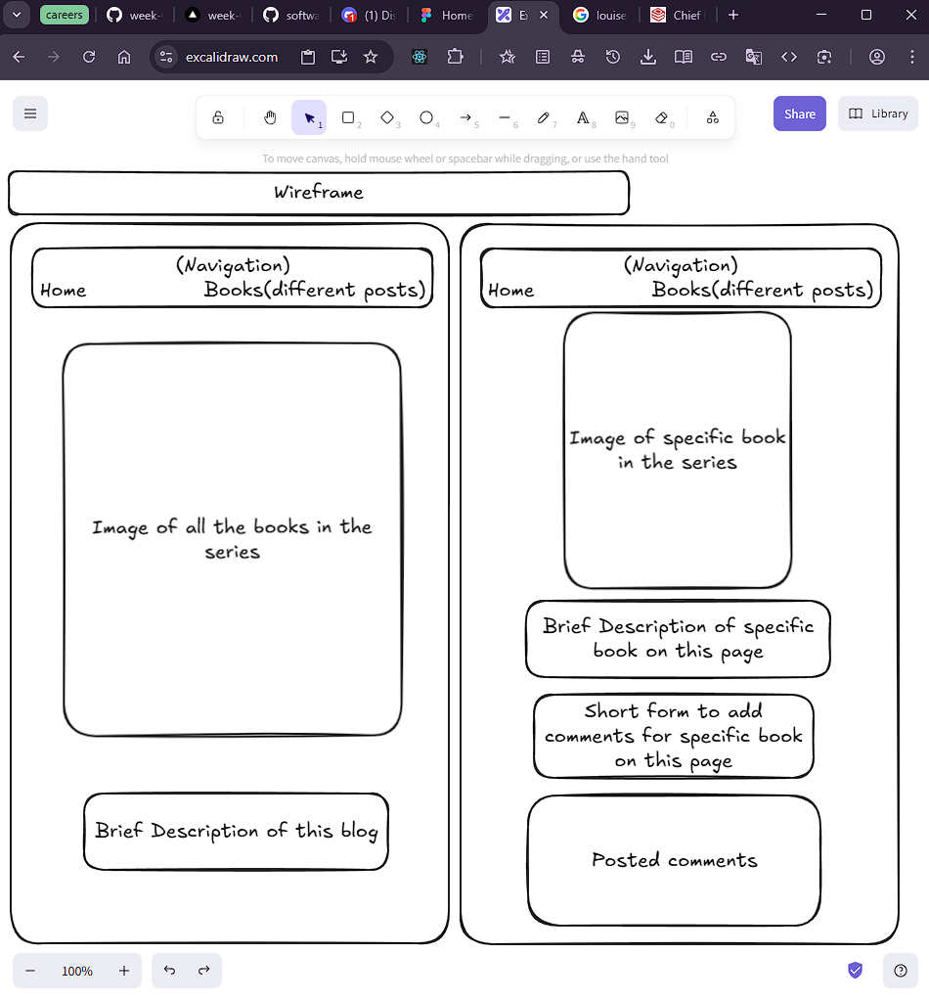
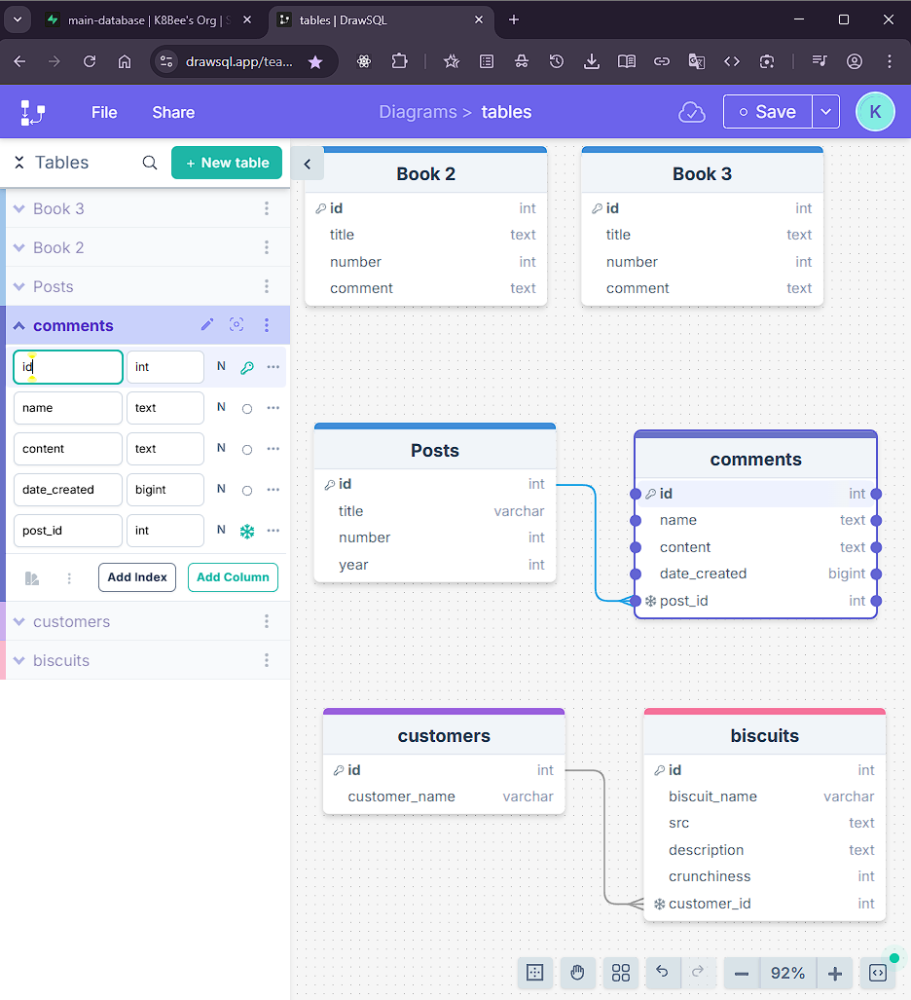

<!-- Git flow:
 starting from terminal, when in git:(main), type:
 git checkout -b newBranchName
 git add .
 git commit -m "commit message"
 git push --set-upstream origin newBranchName
 Then go to the GitHub repo and click: "compare & pull request", then "create pull request", then "merge pull request", then "confirm merge", then "delete branch"
 back in terminal, type:
 git checkout main
 git pull
 Note: can start a new branch straight away, or make changes and then create the branch as above just before adding, pushing, pulling, deleting the branch
 -->

## Plan your wireframe --> Ok so, Excalidraw

- What does my app look like from the user's perspective?
- Excalidraw 

## Plan your database schema --> DrawSQL OR Figma UML diagrams

- DrawSQL 

## What data do I need to store?

Based on the data, how many tables do I need to organise my data efficiently?

- two tables, posts table to hold each of the books (posts) in the series and a comments table
  If you have two or more tables, what's the relationship between them?
- one to many
  How do I connect the tables? Do I need foreign keys? Do I need junction tables?
- foreign key no junction table
- Have a posts table and a comments table
- One post is going to be connected through its id have MANY comments
- Need reference in comments table so the post can connect to and the comments know what post is connecting to specifically, need new column
- So the post table will be connected to many comments tables
- One entry from one table can have many connections
- The foreign key (reference to primary key in another table e.g. if ) would go in the comments table
- Foreign keys go in the many table (the table with a many connection)
  Set up your tables in a database in Supabase

## Create a project (database), if you don't have one already

Use the SQL editor to create your tables and insert seed data (add them to a seed file for us to see them when we mark)
You can also use the seed.js file to create and seed your tables

## Upload to GitHub and deploy to Vercel

- Done
